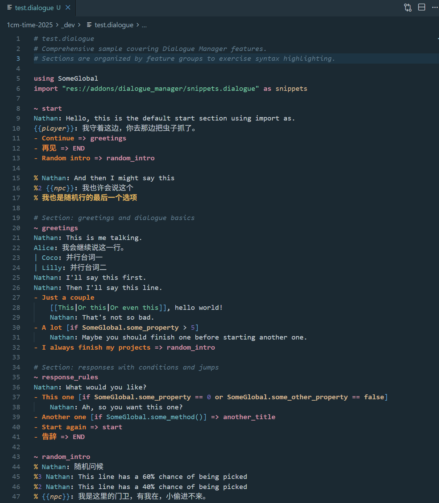
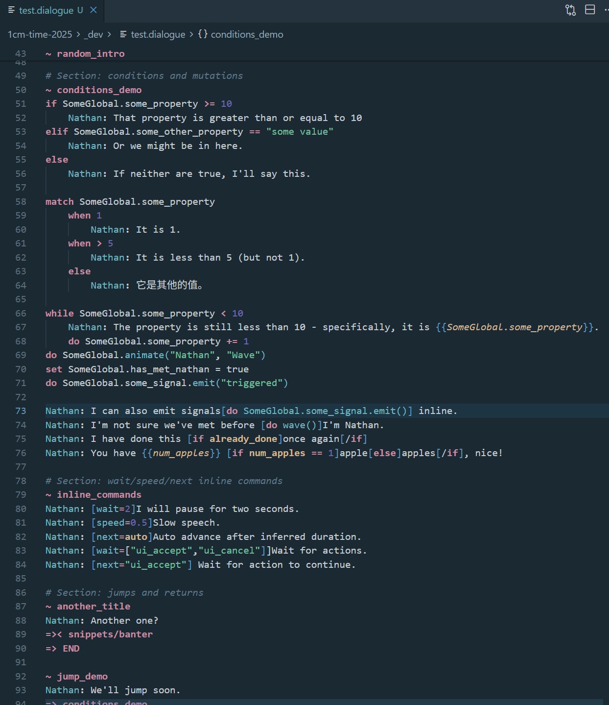
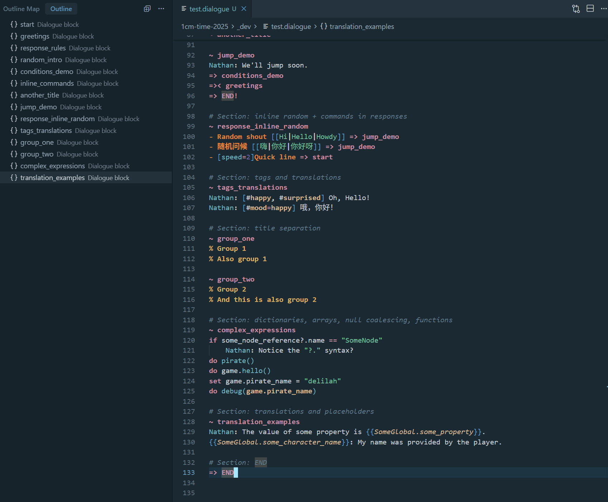

# Godot Dialogue Manager Files

[Dialogue Manager addon](https://github.com/nathanhoad/godot_dialogue_manager) – an addon for Godot 4.4+ that provides a stateless branching dialogue editor and runtime. Write your dialogue in a script-like way and easily integrate it into your game.

VS Code / Cursor extension that adds syntax highlighting and helper commands for `.dialogue` files generated by Godot 4’s Dialogue Manager. This plugin was created with AI assistance to accelerate setup and scaffolding.

## Features

- Detects `.dialogue` files and applies a TextMate grammar tailored to Dialogue Manager syntax
- Highlights keywords, properties, variables, interpolations, comments, section headers, speaker names, and response lines
- Ships with the sample command `Godot Dialogue Manager: Hello World`
- Provides outline/Document Symbols for `~ title` sections so they appear in the Outline and Outline Map views
- Supports Go to Definition (`F12` / `Alt+Click`) from `=> jump_to` lines to their matching `~ title` sections
- Tip: VS Code’s built-in bracket pair colorization may tint `{{` / `}}` differently even though the grammar assigns them the same scope. Disable the feature in editor settings if you prefer a uniform color.

## Screenshots





## Development

```bash
npm install
npm run watch
```

Launch the extension host via `F5` in VS Code/Cursor.

Open `test.dialogue` inside the Extension Development Host to manually verify highlighting, outline symbols, and jump-to-definition behavior.

## Packaging

```bash
npm run compile
vsce package
```

Update the `publisher` field if you fork and publish under your own name.
